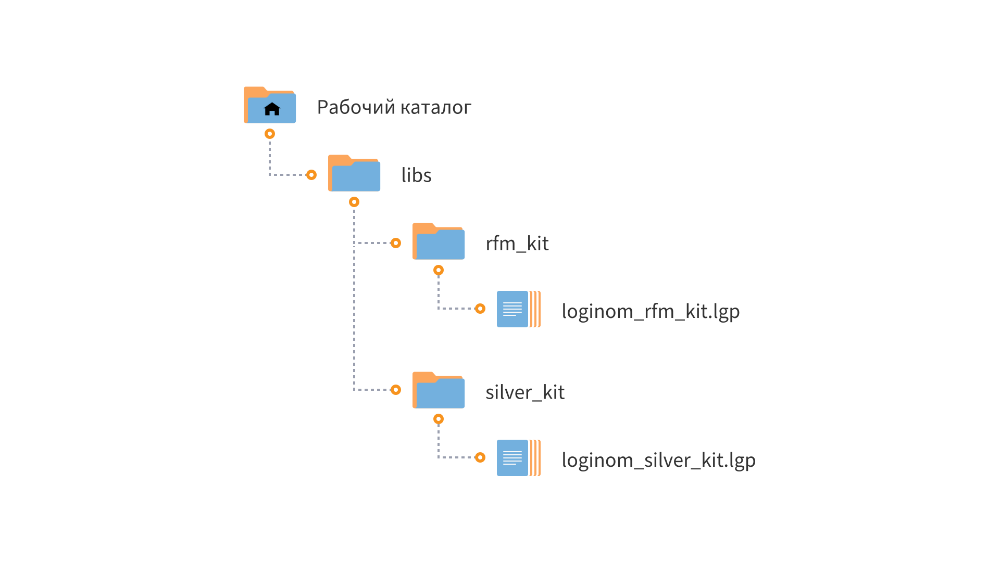

# Loginom RFM Kit CE

* Версия: 2.0.0
* Проверено: Loginom CE 6.5.1

Компоненты библиотеки **Loginom RFM Kit CE** реализуют группу методов сегментации, основанных на RFM-методах и их различных вариациях. Поставляются к бизнес-курсу [Базовые методы сегментации клиентов](https://loginom.ru/learning/content/base-segmentation-course) в Loginom Skills. Входными данными служат клиентские транзакции.

Реализованы несколько методов: RF, RFM, LRFM, бинарная сегментация. Для ряда методов добавлено объединение сегментов по архетипам. Компоненты отличаются между собой:
* самим методом сегментации;
* фиксированным или переменным (задаваемым пользователем) числом сегментов;
* режимом работы: компонент строит модель сегментации или позволяет "прогнать" данные через готовую модель.

Мнемоника названий компонентов следующая.
* Постфикс **–a** означает, что границы сегментов рассчитываются автоматически (строится модель сегментации).
* Постфикс **–m** означает, что границы сегментов должны быть поданы на вход пользователем (осуществляется "прогон" через готовую модель).
* Числа в названии компонентов означают, что на выходе будет фиксированное число сегментов. Например, **RF 5x4** — RF-сегментация с разбиением **R** на 5 интервалов и **F** на 4 интервала. Фиксированные разбиения необходимы, чтобы распределить сегменты по архетипам.

В данной библиотеке все методы, а также классификации архетипов взяты из лучших практик по клиентской аналитике. По возможности мы приводим ссылки на первоисточник.

# Установка и настройка

## Требования

Для работы  библиотеки **Loginom RFM Kit CE** необходимо:

* Loginom Community Edition. Коммерческие версии Loginom не поддерживаются;

* Библиотека **Loginom Silver Kit** ([скачать на GitHub](https://github.com/loginom/loginom-silver-kit)). Версия не ниже 2.0.0.

## Порядок установки

1. Определите рабочий каталог, где будут расположены ваши библиотеки на локальном диске.
2. Создайте в нем подкаталог **customer_intelligence_pack**.
3. Разместите папку **rfm_kit** в каталоге **customer_intelligence_pack**.
4. Убедитесь, что библиотека **Loginom Silver Kit** находится в корне рабочего каталога в папке **silver_kit**.

